# lzha0080_9103_tut07
# **Creative Coding Major Project**
## **Personal Code: Time-based**
After observing the pictures and group code structure after group code generation, I chose Tiem-based as the part to present my personal code.

## **Ideas and thoughts**
First, in the group code Image 1, you can see that, in addition to the background color, the bottom layer is a long yellow rectangle that spans the entire window, and on these long rectangles there are small squares that can change randomly with each page refresh. There are also rectangles of different sizes and colors that can change positions randomly. So my first idea is to first change all the graphic elements to fixed, and at the same time change the small squares that change randomly in the group code to comment status.

>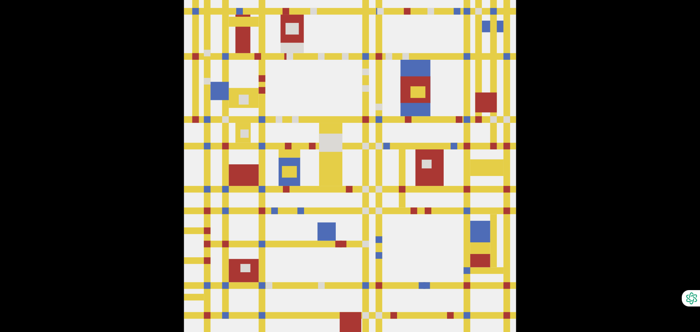 **Image 1**

Then my **idea** was to first use the setInterval code logic to add different numbers of small squares that can move automatically on the yellow long rectangle as the bottom base, so that it can move from left to right, from right to left, from top to bottom and from bottom to top. Then use the frameCount code logic to set a looping time period so that the background color can be displayed from white to black and then from black to white. I got these inspirations from the artwork itself. Piet Mondrian's 'Broadway Boogie Woogie' was created by the author based on the New York city blocks. It can be said that the yellow long rectangle represents the street, so I want to use small squares moving at different speeds to represent the traffic flow. The cycle of the background from white to black and then to white represents the change of time: from day to night. In this way, the whole work represents the prosperity of the city. Regardless of day or night, there is still a huge amount of traffic shuttling between the city roads, just like Image 2. 

>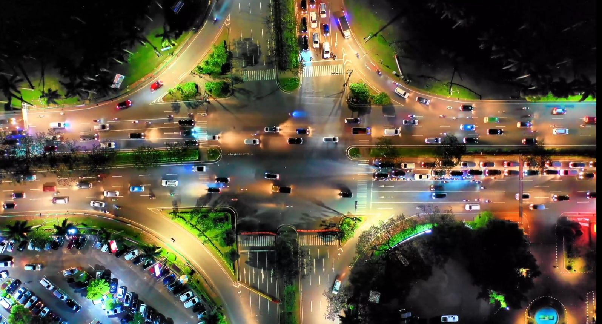 **Image 2**

## **How to implement a personal code**
In my personal code, in the first step, I first defined the rectangle to be moved (Image 3), then increased the frame rate variable (Image 4), then created a random number of small squares (Image 5), and then randomly generated multiple rectangles in the specified area (Image 6), ensuring that they do not overlap, and assigned random colors and speeds to each rectangle. Then use the updateRects function (Image 7) to continuously update the position of the rectangle, move it to the left, and reposition it to the right border after the rectangle leaves the view area, while assigning new speeds and colors, so as to achieve the circular movement of the rectangle in the view. Finally, determine again whether the generated small squares overlap (Image 8).

>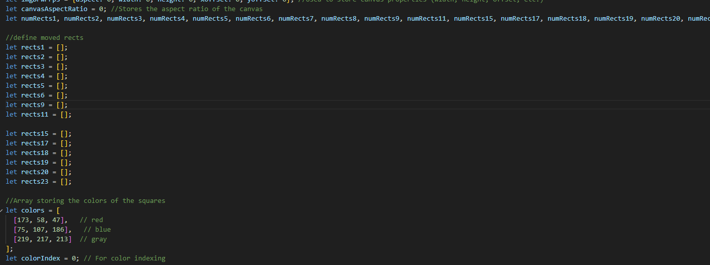 **Image 3**

>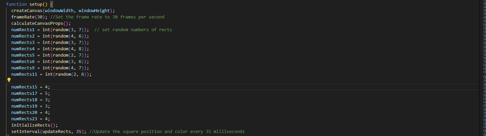 **Image 4**

>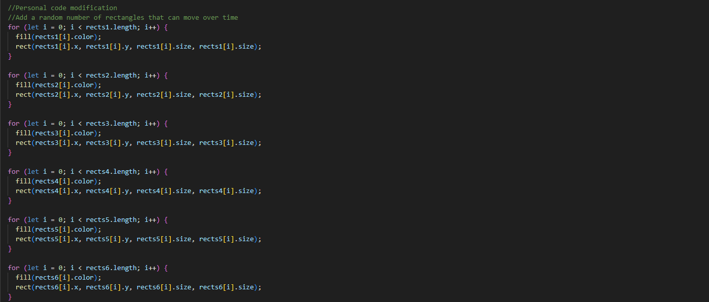 **Image 5**

>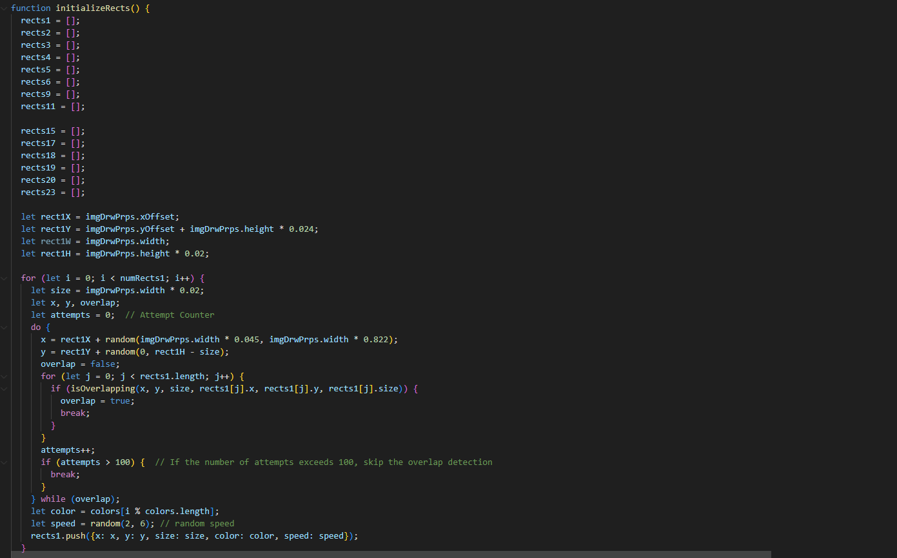 **Image 6**

>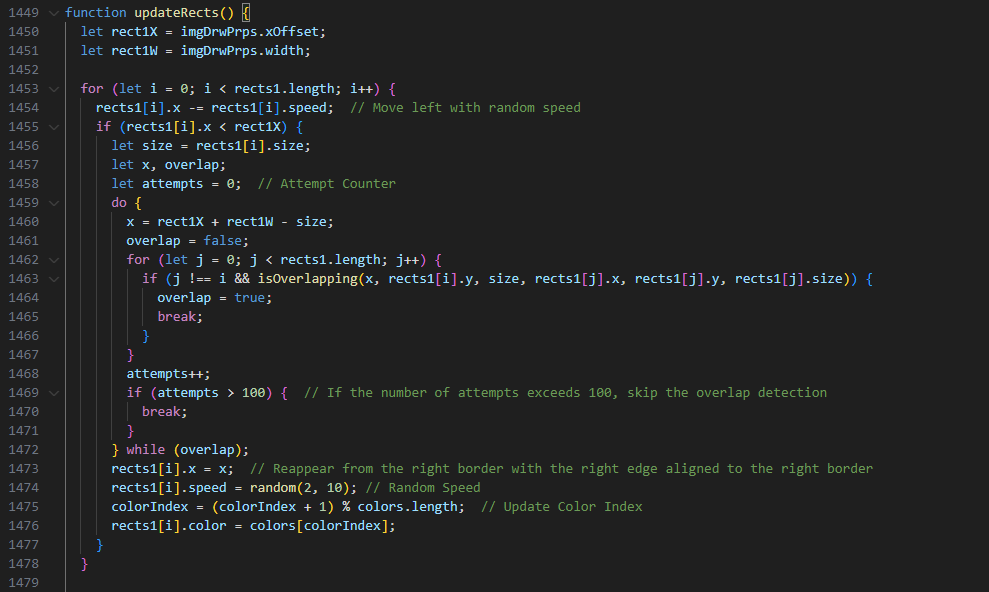 **Image 7**

>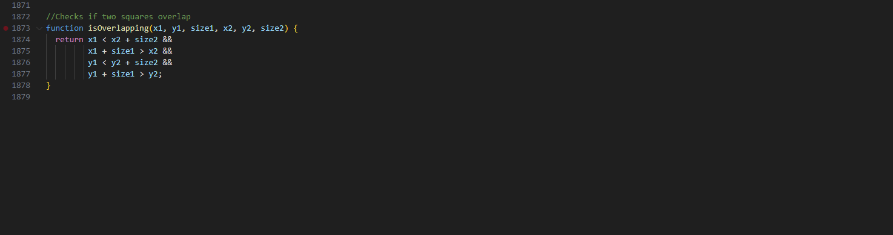 **Image 8**

In the second step, add a time cycle through the frameCount code logic, and then change the background color to change linearly with the cycle (Image 9). Time changes automatically without additional operations. I tried to use gif to display it, but the file was too large to display, so it would be more convenient to open the html directly for browsing.

>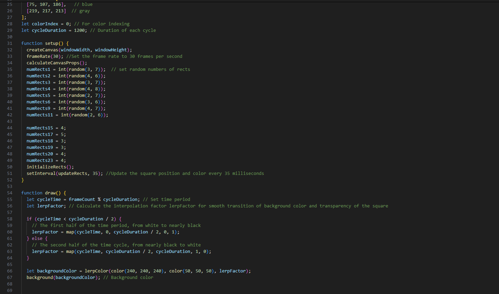 **Image 9**

### **Group Work: Section 3 - Implementation (Replenish)**
Since I am one of the lead writer of the group code, I would like to provide some additional comments on the iterations of section 3 of the group section, as these may not be mentioned in the group pdf file.

After observing the principles of the artwork, we thought of a process for creating our group’s code:
- Step 1: Create the bottom layer element: a yellow rectangle; (Image 10)
  
>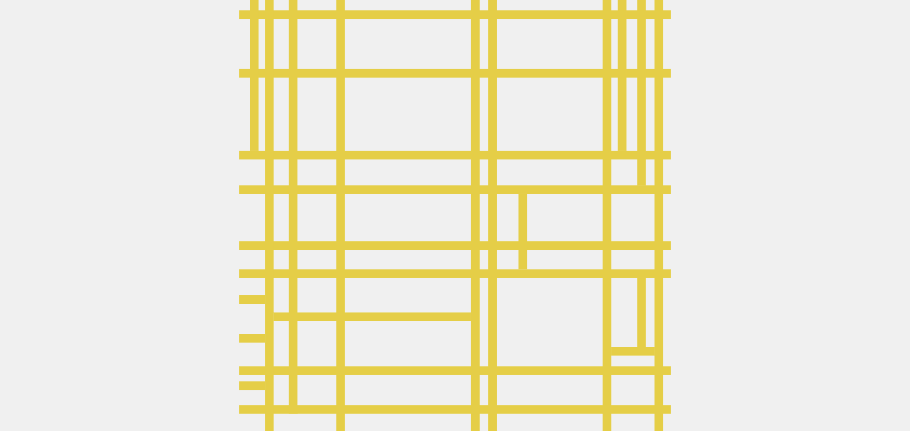 **Image 10**

- Step 2: Create fixed cross-shaped small square elements on the long rectangle; (Image 11)
  
>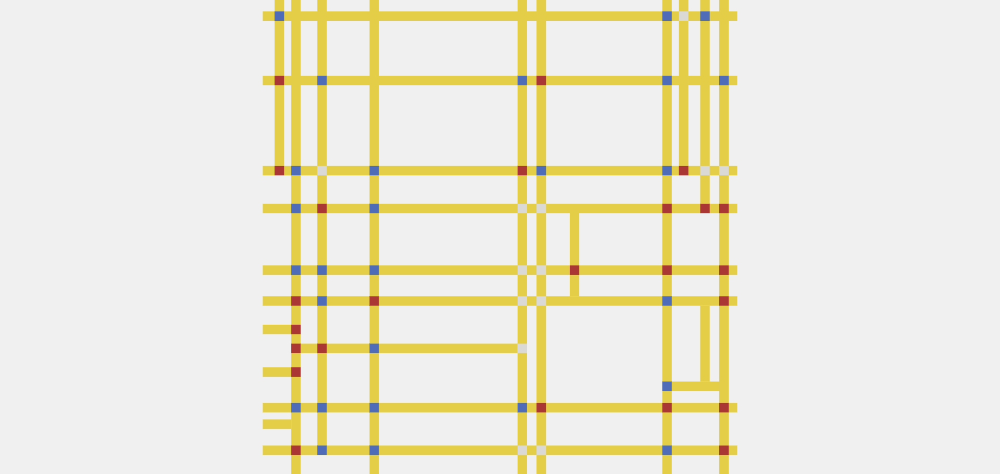 **Image 11**

- Step 3: Create some fixed rectangular elements and create small square and rectangular elements that can be randomly positioned; (Image 12)

>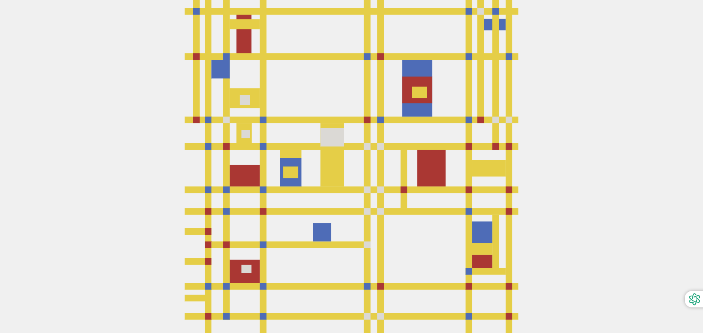 **Image 12**

- Step 4: Check if the entire code runs properly. For example, whether the image can change with the browser window size; (Image 13 & 14)

>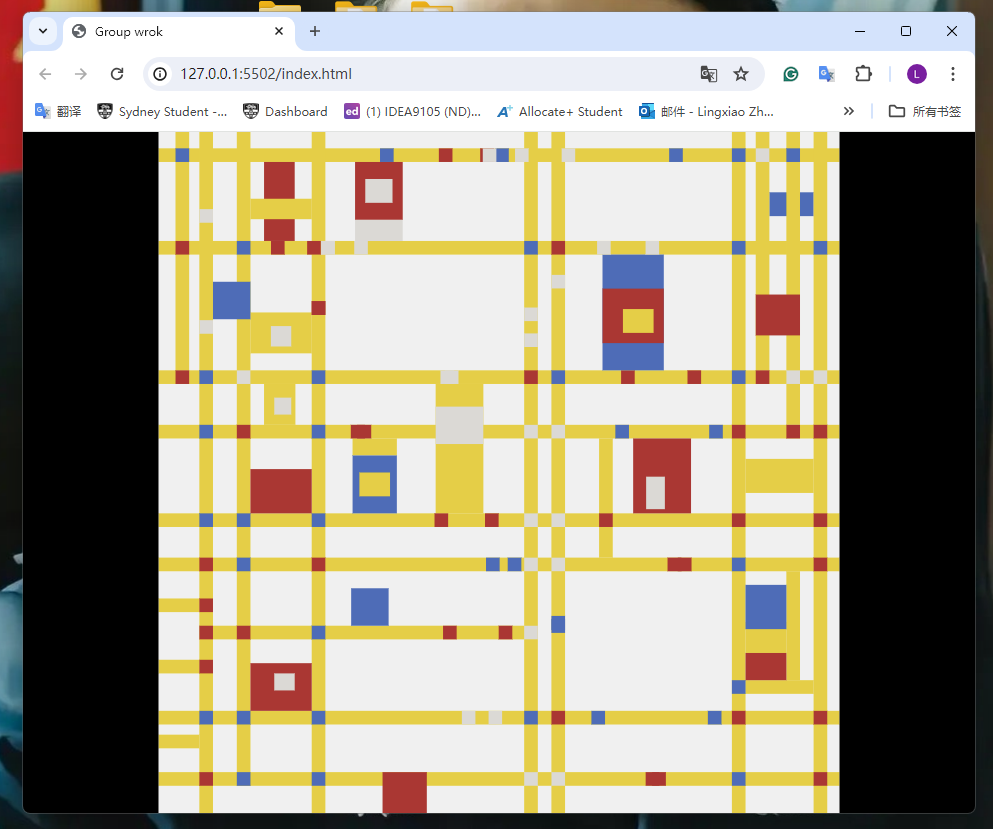 **Image 13**

>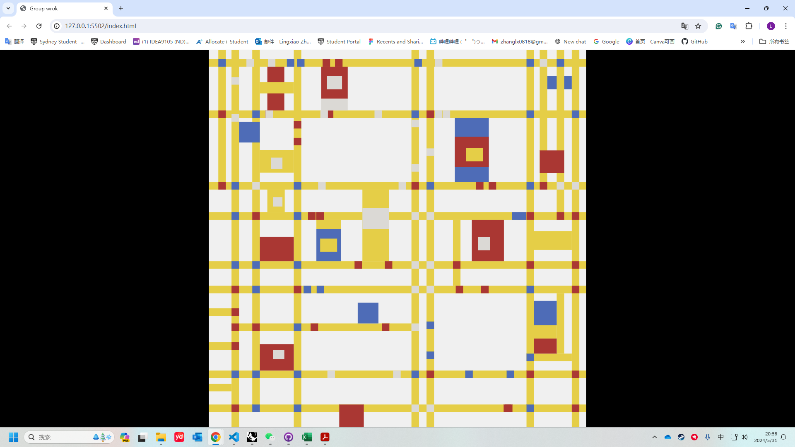 **Image 14**

In the code logic of the group code, we used the basic element structure; random attribute element structure; for loop structure; and how to make the image change with the browser window size;
Partial screenshots of the group code logic: Image 15, 16, 17

>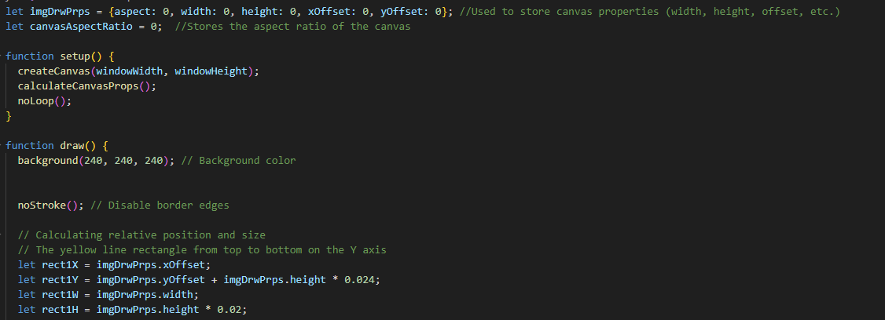 **Image 15**

>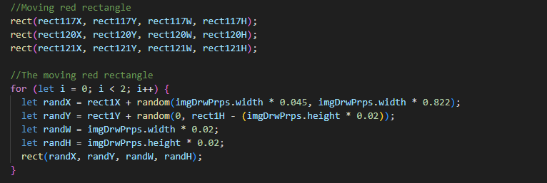 **Image 16**

>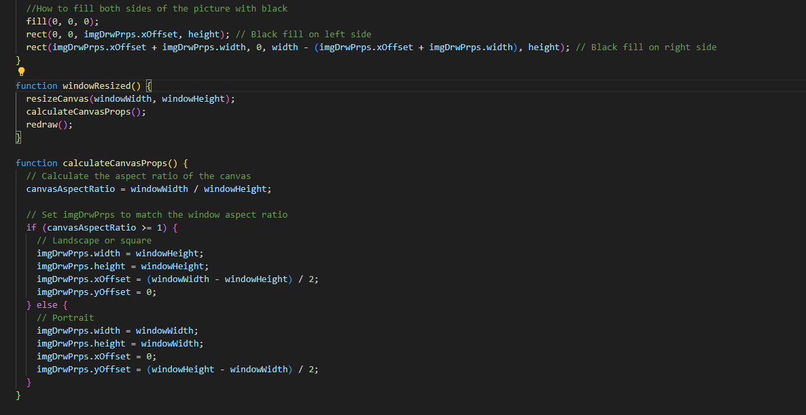 **Image 17**
