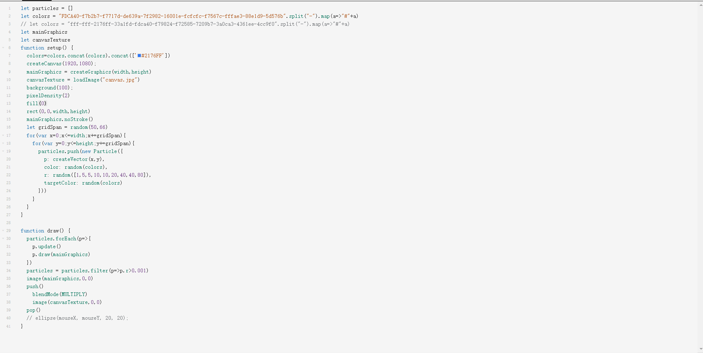

# lzha0080_9103_tut07

This is my first local change to the pool

# **Quiz 8**
## **Part 1: Imaging Technique Inspiration**
I got some inspiration from the teamLab website. Although there are many works on teamLab that are realized through lighting effects, I thought that I could use code lines, particles, etc. to replace the lighting effects. From what is shown in these pictures, the effect of jump or transformation can be achieved by fusing and extracting some elements in the pictures and adding interactivity. teamLab's own works also focus on aspects such as fluidity, interactivity and flow changes, and the final work can be realized by incorporating these elements.

#### *Inspiration Image 1*

Reference: [Link Text](https://www.teamlab.art/w/lightvortex/
Links to an external site.)
#### *Inspiration Image 2*

Reference: [Link Text](https://www.teamlab.art/w/infinite_crystaluniverse/
Links to an external site.)
#### *Inspiration Image 3*

Reference: (https://www.teamlab.art/w/infinitecrystalworld/
Links to an external site.)

## **Part 2: Coding Technique Exploration**
I got some code inspiration from the OpenProcessing web page. The coding technology is mainly based on p5.js, and artistic display is achieved by adding object systems such as Physarum and Particle. At the same time, interactive elements can be added, which can be achieved by mouse clicks or space, or by moving the mouse. For example, typing space on the keyboard can change the color or object. When the mouse is hovering, the element particles can slowly move away from or approach the mouse. Clicking the mouse can Add a new number of elements, etc.

Coding using list (Initial thoughts)
- Add Particle element
- Add Physarum
  - Color change
  - Size change
  - Direction change
- Add Interaction Part

***(Some sample codes are too long, you can view them through the reference link)***
#### *Inspiration Coding Image 1*

#### *Inspiration Coding Image 1.1*

Reference: [Link Text](https://openprocessing.org/sketch/1217113
Links to an external site.)
#### *Inspiration Coding Image 2*

Reference: (https://openprocessing.org/sketch/2166108
Links to an external site.)
#### *Inspiration Coding Image 3*

#### *Inspiration Coding Image 3.1*

Reference: (https://openprocessing.org/sketch/2090595
Links to an external site.)
#### *Inspiration Coding Image 4*

Reference: (https://openprocessing.org/sketch/2095626
Links to an external site.)
